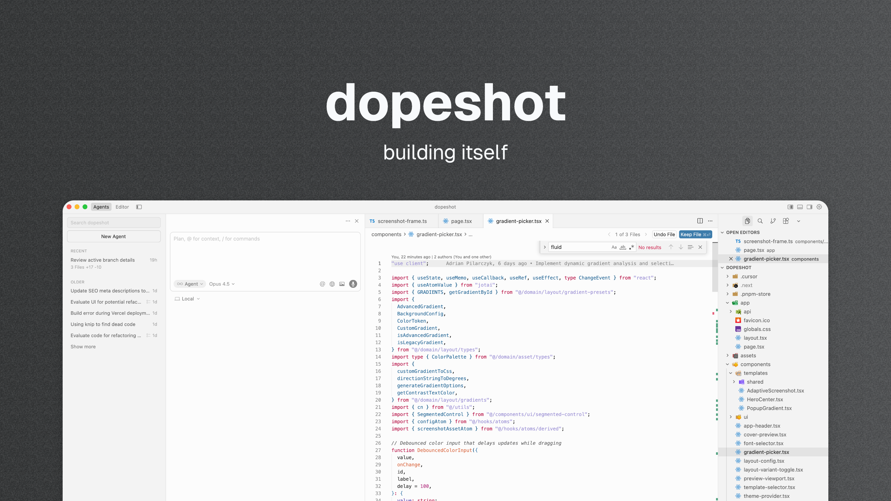

# dopeshot

**Turn screenshots into share-ready graphics. In seconds.**

For indie hackers who ship fast and post often.

→ [Try it now](https://dopeshot.co)

---

## Why dopeshot?

You just shipped something. Now you need to post about it. Opening Figma feels like overkill. dopeshot gets you from screenshot to Twitter-ready in under 15 seconds.

Drop a screenshot, pick a vibe, export. That's it.

## Features

### Smart gradients

Auto-matched to your screenshot's palette. No color theory required.

### Typography vibes

Pick a mood, not a font. Founder. Terminal. Billboard. Edge. Circuit. BlackTie. Buddy. Civic.

### Three looks

- **Peak** - Gradient hero with headline and elevated screenshot frame
- **Spotlight** - Split layout with copy on one side, tall screenshot on the other
- **Backdrop** - Let a single screenshot shine with adaptive sizing

### Export ready

Sized for Twitter and LinkedIn. High-res PNG, no watermark.

---

## The Stack

Built with Next.js, Tailwind, Jotai. MIT licensed.

## Contributing

Ideas? Bugs? [Open an issue](https://github.com/yourusername/dopeshot/issues).

Want to add a look or typography preset? Check out the [authoring guide](./AUTHORING.md).

---

Built by indie hackers, for indie hackers. Ship fast, post faster.
